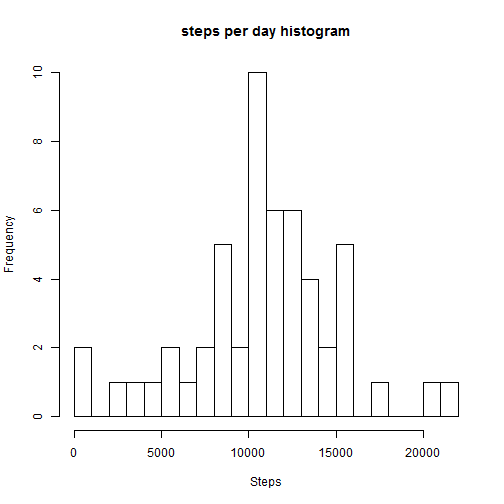
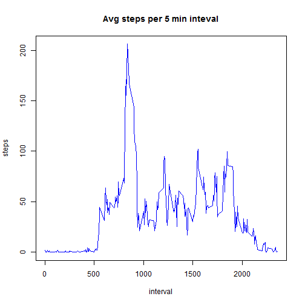
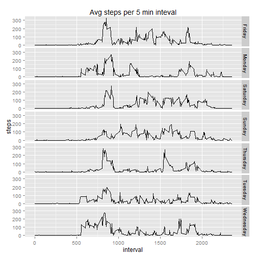
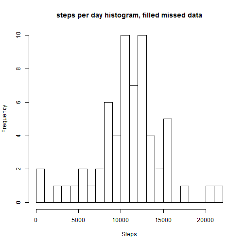
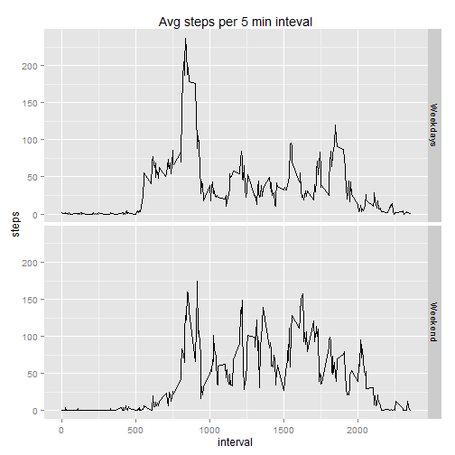

This assignment makes use of data from a personal activity monitoring device. This device collects data at 5 minute intervals through out the day. The data consists of two months of data from an anonymous individual collected during the months of October and November, 2012 and include the number of steps taken in 5 minute intervals each day.


```r
## Download file to temp file at local path
temp<-"repdata-data-activity.zip" ## Get file from local path
if (!file.exists(temp))
{  fileurl<-"https://d396qusza40orc.cloudfront.net/repdata%2Fdata%2Factivity.zip"
  download.file(fileurl, temp)}
## Unzip downloaded file
unzip(zipfile = temp)
## Read csv file
activity <- read.csv2("activity.csv", header = TRUE, sep = ",")
str(activity)
```

```
## 'data.frame':	17568 obs. of  3 variables:
##  $ steps   : int  NA NA NA NA NA NA NA NA NA NA ...
##  $ date    : Factor w/ 61 levels "2012-10-01","2012-10-02",..: 1 1 1 1 1 1 1 1 1 1 ...
##  $ interval: int  0 5 10 15 20 25 30 35 40 45 ...
```

```r
# Convert date from text
activity$dt <- as.Date(activity$date, '%Y-%m-%d')
activity$wday <- weekdays(activity$dt) # add weekdays
```

##Data

The variables included in this dataset are:

**steps**: Number of steps taking in a 5-minute interval (missing values are coded as NA)

**date**: The date on which the measurement was taken in YYYY-MM-DD format

**interval**: Identifier for the 5-minute interval in which measurement was taken

The dataset is stored in a comma-separated-value (CSV) file and there are a total of 17,568 observations in this dataset.


```r
# Mean and median of steps
mn_st <- mean(st_d$x, na.rm = TRUE)
mn_st <- as.character(format(mn_st, digits = 6)) # make clear value formatted 
md_st <- median(st_d$x, na.rm = TRUE)
md_st <- as.character(format(md_st, digits = 6))  # make clear value formatted
```

##Mean and median of steps per day

**Mean** is steps per day is 10766.2 and **Median** is 10765, you can see it also on histogram. 


```r
# sum of steps by days
st_d <- aggregate(activity$steps, by=list(day=activity$date), FUN=sum) 
# Histogram of steps by days
hist(st_d$x, breaks = 20, xlab = "Steps", main = "steps per day histogram")
```

 

##Average daily activity pattern


```r
# average of steps by 5 minutes intervals
st_5 <- aggregate(activity[!is.na(activity$steps),]$steps, 
                  by=list(interval=activity[!is.na(activity$steps),]$interval), FUN=mean) 

with(st_5, 
     plot(interval,           # x axis - time intervals
          x,              # y axis 
          main="Avg steps per 5 min inteval",
          xlab = "interval",  # x axis label 
          ylab ="steps", # y axis label
          type="l", #lines
          pch=21,  # filled circle,
          col="blue"
     )) 
```

 


```r
mx_st <- st_5[which.max(st_5$x),]
```

5 minute interval of 835  contains the maximum number of steps = 206.1698113.  

###Missing values
 

```r
na.v <- sum(is.na(activity$steps))
```

Data contains 2304 missing values.


```r
stwd <- aggregate(activity[!is.na(activity$steps),]$steps, 
                  by=list(interval=activity[!is.na(activity$steps),]$interval,
                          wday=activity[!is.na(activity$steps),]$wday),
                  FUN=mean)
library(ggplot2)
g <- ggplot(stwd, aes(interval, x))

g+ geom_line() +
  facet_grid(wday ~ .) +       # facets by weekdays
  labs(title = "Avg steps per 5 min inteval")  + labs( y = "steps")         
```

 

As we can see from graph above, number of steps mean is different for week days.
So my strategy is to fill missing values with such mean by week day and 5 minutes interval.


```r
filled_na <- merge(activity, stwd, by=c("wday", "interval"))
filled_na$filled <- ifelse(!is.na(filled_na$steps), filled_na$steps, filled_na$x)

# sum of steps by days
st_d2 <- aggregate(filled_na$filled, by=list(day=filled_na$date), FUN=sum) 
# Histogram of steps by days
hist(st_d2$x, breaks = 20, xlab = "Steps", main = "steps per day histogram, filled missed data")
```

 

```r
# Mean and median of steps
mn_st2 <- mean(st_d2$x, na.rm = TRUE)
mn_st2 <- as.character(format(mn_st2, digits = 6)) # make clear value formatted 
md_st2 <- median(st_d2$x, na.rm = TRUE)
md_st2 <- as.character(format(md_st2, digits = 6))  # make clear value formatted
mchange <- ifelse(mn_st2 > mn_st, "increased", 
                  ifelse(mn_st2 = mn_st, "not changed", "decresaed"))
```

With filled NAs **Mean** is steps per day is 10821.2 and **Median** is 11015, compated to 10766.2 and 10765 correspondingly.    
Total number of steps mean increased.  

##Steps on weekdays and weekend

In order to see is there difference in number of steps pattern on weekdays and weekend, I add new factor in our dataset.
Below you can see graph illustrating such patterns. 

```r
filled_na$daysoff <- ifelse(filled_na$wday %in% c("Sunday", "Saturday"), 
                            "Weekend", "Weekdays")

stww <- aggregate(filled_na$filled, 
                  by=list(interval=filled_na$interval,
                          wday=filled_na$daysoff),
                  FUN=mean)
# library(ggplot2)
g <- ggplot(stww, aes(interval, x))

g+ geom_line() +
  facet_grid(wday ~ .) +       # facets by weekdays
  labs(title = "Avg steps per 5 min inteval")  + labs( y = "steps") 
```

 

